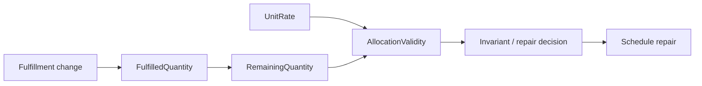
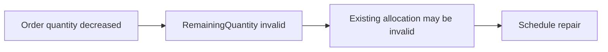

# Raffinert.Consistency

**Declarative consistency for ordinary .NET objects.**

When one value changes, other calculated values, invariants, and relationships may become stale or invalid.
Raffinert.Consistency lets you declare those dependencies once instead of maintaining the same consistency
logic across setters, handlers, services, and persistence code.

```csharp
var unitRate = model.Derived(associations)
    .DependsOn(x => x.Source.UnitValue)
    .DependsOn(x => x.Target.UnitValue)
    .Select(x => UnitRateCalculator.Calculate(
        x.Source.UnitValue,
        x.Target.UnitValue));
```

Now a change to either input has an explicit consequence:

```text
Source.Value ─┐
              ├──> UnitRate ──> Invariant ──> repair / persistence
Target.Value ─┘
```

Raffinert determines what is affected, propagates invalidation through the dependency graph, evaluates the
state that matters, and can integrate with EF Core to validate invariants and persist derived mirrors at the
save boundary.

> **You declare what depends on what. Raffinert derives the consistency machinery.**

The dependency-free core targets .NET 8 and .NET 10. The EF Core adapter targets .NET 10 / EF Core 10.
Raffinert.Consistency is pre-1.0 and currently available as a release candidate. APIs may still change before
1.0.

## EF Core + DI: the common application path

For EF Core applications, the intended day-to-day workflow is deliberately small: register the compiled
consistency model once, inject the scoped runtime next to your `DbContext`, mutate ordinary tracked entities,
and keep using ordinary `SaveChanges` / `SaveChangesAsync`.

```csharp
services.AddDbContext<AppDbContext>(options =>
    options.UseSqlServer(connectionString));

services.AddRaffinertConsistency<AppDbContext>(
    compiledModel,
    mappings);
```

Application services do not need to publish old/new values or manually orchestrate dependency updates:

```csharp
public sealed class LinkService(
    AppDbContext db,
    IConsistencyRuntime consistency)
{
    public async Task ChangeAsync(
        long id,
        decimal value,
        CancellationToken cancellationToken)
    {
        var link = await db.Links
            .Include(x => x.Left)
            .Include(x => x.Right)
            .SingleAsync(x => x.Id == id, cancellationToken);

        link.Left.Value = value;

        // Only needed when a materialized mirror is read before SaveChanges.
        consistency.Materialize(link);

        await db.SaveChangesAsync(cancellationToken);
    }
}
```

Use `IConsistencyRuntime` in ordinary application services when only `Evaluate` and `Materialize` are
needed. Inject the concrete `ConsistencyRuntime` when advanced engine APIs such as mutation planning or
diagnostics are required. Both dependencies resolve to the same scoped runtime in the EF integration.

The narrow application contract can be substituted directly in service tests. For example, with
NSubstitute:

```csharp
var consistency = Substitute.For<IConsistencyRuntime>();
var service = new LinkService(db, consistency);

await service.ChangeAsync(id, value, cancellationToken);

consistency.Received(1).Materialize(
    Arg.Is<Link>(x => x.Id == id));
```

Tracked entities are admitted into the scoped consistency runtime automatically. If no materialized value is
needed before persistence, skip `Materialize` and just call `SaveChangesAsync`; the EF integration evaluates
and synchronizes affected configured state at the save boundary, then commits runtime state only after the
database save succeeds.

## Why?

Consistency logic tends to spread as a system grows:

- a handler changes a field;
- another service knows which calculation must be refreshed;
- another query finds the affected consumers;
- another rule decides whether stale state is merely dirty or already unsafe;
- persistence code must remember what needs to be validated or materialized.

The individual rules are usually simple. **Remembering every consequence from every mutation path is not.**

Raffinert makes that dependency graph explicit and executable.

## Core capabilities

- Expression-defined binary relations whose original predicate remains the semantic authority
- Automatic dependency and nested member-path analysis
- Incremental hash indexes and reverse navigation where analysis proves them safe
- Correct scan fallback for unsupported or opaque query expressions
- Lazy derived state with **Fresh**, **Dirty**, and **Invalid** semantics
- Derived-value dependency graphs, including projected cross-object dependencies
- Exact and conservative propagation strategies
- Incremental `Count`, `LongCount`, `Any`, and numeric `Sum` plans
- Invariants with immediate evaluation, invalidation, or deferred repair
- Summary and causal impact reporting
- Binding execution plans for transaction/outbox integration
- Optional EF Core change-tracker integration
- Compiled-model and runtime diagnostics

The core package has no EF Core or dependency-injection dependency.

## Logical values and physical mirrors

Calculation, invalidation, storage, and consequences are separate concepts:

| API | Meaning |
| --- | --- |
| `From(...)` | Flow a current logical relation or derived value into another definition. |
| `DependsOn(...)` | Track a source member read by opaque calculator code. |
| `MaterializeTo(...)` | Configure an optional physical mirror of a logical value. |
| `Evaluate(...)` | Make a logical value current and return it without writing its mirror. |
| `Materialize(...)` | Synchronize configured physical mirrors. |
| `Invariant(...)` | Declare required truth. |
| `ScheduleRepairWith(...)` | Handle a consistency consequence after mutation commit. |

For example, `UnitRate` receives the logical `PriceRate`; it never reads the potentially stale mirror:

```csharp
var priceRate = model.Derived(links)
    .DependsOn(
        x => x.InvoiceLine.Price,
        x => x.PurchaseOrderLine.Price)
    .Select(CalculatePriceRate)
    .MaterializeTo(x => x.PriceRate)
    .Named("price-rate");

var unitRate = model.Derived(links)
    .From(priceRate)
    .DependsOn(
        x => x.InvoiceLine.Quantity,
        x => x.PurchaseOrderLine.OrderedQuantity)
    .Select((link, rate) => CalculateUnitRate(link, rate))
    .MaterializeTo(x => x.UnitRate)
    .Named("unit-rate");
```

Logical evaluation and physical synchronization are deliberately different operations:

```csharp
var currentRate = runtime.Evaluate(priceRate, link); // link.PriceRate is unchanged
runtime.Materialize(link);                          // synchronizes PriceRate and UnitRate
```

`runtime.Materialize(priceRate, link)` synchronizes only that definition. Object-level materialization
evaluates all configured values first, writes only mirrors on that registered object, skips equal assignments,
and rolls back earlier physical writes if a later setter fails. It does not dispatch repair or evaluate
unrelated runtime-only values. Reading `link.PriceRate` directly is not guaranteed fresh before materialization.

## EF Core consistent saves

For dependency-injected EF applications, register the compiled model and mappings once. The adapter
provides one scoped runtime/session pair, admits mapped tracked entities automatically, and attaches its
save interceptor without exposing EF consistency plumbing to application services:

```csharp
services.AddDbContext<AppDbContext>(options => options.UseSqlServer(connectionString));
services.AddRaffinertConsistency<AppDbContext>(compiledModel, mappings);
services.AddScoped<LinkService>();
```

Register `AddRaffinertConsistency<TDbContext>` exactly once per `IServiceCollection`. Resolve or inject the
scoped runtime before application code mutates consistency-relevant tracked state. Clean entities tracked
before the runtime is first resolved are supported and admitted as baseline state. First runtime binding
rejects pending EF member changes only when the changed member is used by a configured consistency key,
dependency, invariant, relation, or projected selector; mapped additions and removals remain conservative.
Ordinary mapped properties unused by the consistency model, and dirty entities outside its mappings and
dependency graph, do not block binding.

An ordinary application service only needs its `DbContext` and the scoped `IConsistencyRuntime`:

```csharp
public sealed class LinkService(AppDbContext db, IConsistencyRuntime consistency)
{
    public async Task ChangeAsync(long id, decimal value, CancellationToken cancellationToken)
    {
        var link = await db.Links
            .Include(x => x.Left)
            .Include(x => x.Right)
            .SingleAsync(x => x.Id == id, cancellationToken);

        link.Left.Value = value;
        consistency.Materialize(link); // needed only when mirrors are read before saving
        Use(link.Ratio, link.NormalizedRatio);
        await db.SaveChangesAsync(cancellationToken);
    }
}
```

The interface is the recommended dependency for logical evaluation and materialization. The concrete
`ConsistencyRuntime` remains available for advanced mutation, planning, and diagnostic workflows.

The short rule is:

```text
Need a materialized property before SaveChanges?  runtime.Materialize(entity)
Only saving?                                         db.SaveChanges / SaveChangesAsync
```

`Materialize(entity)` prepares the pending consistency plan and updates only configured mirrors on that
entity. Runtime state is installed and policy callbacks dispatch only after a successful SQL save. If
the service changes a semantic input again before saving, the adapter discards the stale pending plan and
rebuilds it. Until SQL succeeds, committed navigation and projection indexes continue to represent the
durable baseline; a failed save leaves them unchanged and a retry builds a fresh plan. Cross-object graphs
still require the authoritative `ConsistencyScope` or
`DiscoverConsumers` proof described below.

Pending plans are bound to both the current semantic runtime state and the tracked baseline/coverage state.
Clean tracking admission and relationship-fixup stabilization complete before the first pending plan is
created. Once that baseline is stable, `Materialize` followed by ordinary `SaveChanges` reuses the plan when
no further semantic mutation or mapped tracking occurs. If another query tracks mapped baseline objects after
materialization, the adapter rolls back pending mirror writes as needed and prepares a fresh plan before
persistence.

The EF Core adapter can reject configured invariant violations before SQL and persist sink-only mirrors
of affected derived values:

```csharp
availableQuantity.MaterializeTo(x => x.AvailableQuantity);

var mappings = new ConsistencyEfCoreMappings()
    .Map(lines)
    .Map(fulfillments)
    .Enforce(availability);

var scope = new ConsistencyScope()
    .Complete(lines)
    .Complete(fulfillments);

await db.SaveChangesConsistentlyAsync(
    runtime,
    mappings,
    new ConsistencySaveOptions { Scope = scope },
    cancellationToken);
```

This stable-key workflow validates authoritative scope, plans first, saves once, then installs the exact
runtime plan. `Map(...)` translates tracked changes; only `ConsistencyScope.Complete(...)` asserts that a
runtime set has complete coverage. Raffinert does not load missing graph data. See
[EF Core consistency](docs/ef-core-consistency.md) for scope, transactions,
generated keys, and recovery rules, or run the
[`Raffinert.Consistency.EntityFrameworkCore.Sample`](samples/Raffinert.Consistency.EntityFrameworkCore.Sample).

Scope completeness proves data coverage in the runtime; it does not prove mutation coverage for SQL-side
effects. Authoritative saves reject EF-declared `ON DELETE CASCADE` and `ON DELETE SET NULL` paths that can
reach consistency-managed state without tracked mutation evidence. Prefer `ClientCascade` / `ClientSetNull`
with explicitly tracked dependents, or `Restrict` / `NoAction` when deletion must be explicit.

For application-owned transactions, generated semantic values from INSERT or UPDATE, or an outbox, capture a
policy-aware work item before the first save, call `PrepareAndPlan()` when generated values are final, persist the returned plan data, commit the
database transaction, then call `CommitAfterDatabaseCommit()` and `Dispatch()`. This path applies the same
scope, enforcement, and materialization policy as convenience saves.

## What Raffinert.Consistency is not

It is not an ORM, event bus, or general-purpose workflow engine.

It does not replace your domain objects or persisted business relationships. Its job is narrower:
**given a graph of relationships and computations, efficiently determine and maintain the consequences
of change.**

## Start with a relation

Relations are ordinary expression trees:

```csharp
var model = new ConsistencyModelBuilder();

var requests = model.Objects<RequestLine>()
    .Key(x => x.Id);

var orderLines = model.Objects<OrderLine>()
    .Key(x => x.Id);

var candidates = model.Relation(requests, orderLines)
    .Where((request, line) =>
        request.OrderNumber == line.OrderNumber &&
        request.ItemNumber == line.ItemNumber);

var compiled = model.Build();
var runtime = compiled.CreateRuntime();

runtime.Add(requests, request);
runtime.Add(orderLines, orderLine);

var related = runtime.Related(candidates, request);
```

Raffinert.Consistency analyzes the predicate and derives hash access paths where it can do so safely.
Unsupported expressions retain the original compiled predicate and fall back to scanning rather than
changing semantics.

## Report ordinary domain changes

Domain objects remain ordinary objects. Mutate them normally, then report what changed:

```csharp
var oldItemNumber = request.ItemNumber;
request.ItemNumber = "ITEM-2";

runtime.Apply(
    Change.Property(
        requests,
        request,
        x => x.ItemNumber,
        oldItemNumber,
        request.ItemNumber));
```

`Change.Property` observes a mutation that has already happened; it does not mutate the object itself.
The runtime validates the change and updates only the runtime-owned state affected by it.

A domain operation can report lifecycle, property, and collection changes together:

```csharp
runtime.Apply(MutationSet.Create(
    Change.Add(orderLines, addedLine),
    Change.Property(requests, request, x => x.ItemNumber, oldItem, request.ItemNumber),
    Change.CollectionReset(order, x => x.Lines),
    Change.Remove(orderLines, removedLine)));
```

The complete mutation set is validated before runtime-maintained state is committed.

## Derived values

Relations become more useful when they feed derived state.

For example, an order line can derive its fulfilled quantity from matching fulfillments:

```csharp
var fulfilledQuantity = model.Derived(orderLines)
    .From(fulfillments)
    .Impact(policy => policy
        .MembershipAdded(DependencySeverity.Dirty)
        .MembershipRemoved(DependencySeverity.Invalid)
        .ItemChanged(DependencySeverity.Invalid))
    .Sum(fulfillment => fulfillment.Quantity);
```

`Sum`, `Count`, `LongCount`, and `Any` select the incremental execution plans directly. Recognized exact
aggregates can update already-fresh cache entries from relation/item deltas.

Derived values can depend on other derived values and form a compiled dependency DAG:

```csharp
var remainingQuantity = model.Derived(orderLines)
    .From(fulfilledQuantity)
    .Select((line, fulfilled) =>
        line.OrderedQuantity - fulfilled);
```

They can also consume upstream values through tracked object references:

```csharp
var allocationValidity = model.Derived(allocations)
    .From(allocation => allocation.OrderLine, remainingQuantity)
    .From(unitRate)
    .Select((allocation, remaining, rate) =>
        allocation.ReservedQuantity <= remaining &&
        allocation.CapturedRate == rate);
```

A change can therefore propagate through a graph such as:



The application does not need to manually orchestrate every edge in that graph.

## Dirty vs Invalid

A dependency becoming stale is not always the same as becoming unsafe.

Raffinert.Consistency distinguishes those cases:

- **Dirty** — the cached value must be recomputed when freshness matters.
- **Invalid** — the value must not be relied upon before recomputation or revalidation.

A relation-backed derived value can classify different kinds of impact independently:

```csharp
var fulfilled = model.Derived(orderLines)
    .From(fulfillments)
    .Impact(policy => policy
        .MembershipAdded(DependencySeverity.Dirty)
        .MembershipRemoved(DependencySeverity.Invalid)
        .ItemChanged(DependencySeverity.Invalid))
    .Sum(fulfillment => fulfillment.Quantity);
```

Typed source-member policies can also classify value transitions—for example, a quantity decrease can be
`Invalid` while an increase remains merely `Dirty`.

## Invariants and repair

Invariants consume direct or derived state and can react when correctness is affected. Reactions can be
immediate or represented as deferred repair work.

This lets a domain model express patterns such as:



without embedding the repair orchestration into every command handler that can affect quantity.

## Explain what changed

Basic `Apply` performs the runtime update without building diagnostic impact data.

When impact needs to be inspected or persisted, use a detailed operation:

```csharp
var application = runtime.ApplyDetailed(
    mutations,
    RuntimeImpactDetailLevel.Causal);

Console.WriteLine(
    RuntimeImpactTraceRenderer.Render(application.Result));
```

Detailed results can include relation pair deltas, affected derived values, invariant impacts, policy
requests, mutation origins, and deterministic direct-cause records.

For durable background work, project the in-process result to strict data-only work:

```csharp
DurablePolicyWork durableWork =
    application.Result.GetDurablePolicyWork();
```

Stable definition names and canonical source identities are required when data crosses a process boundary.

## Transaction and outbox integration

External persistence can separate mutation preparation, runtime commit, and callback dispatch:

```csharp
var prepared = runtime.Prepare(
    mutations,
    ChangeValidationMode.StrictNewValue);

await database.SaveChangesAsync();

runtime.Commit(prepared);
runtime.Dispatch(prepared);
```

When durable external work must exactly match the runtime result, use a binding plan:

```csharp
var plan = runtime.PlanDetailed(
    prepared,
    RuntimeImpactDetailLevel.Causal);

PersistDurablePolicyWork(
    plan.Result.GetDurablePolicyWork());

await database.CommitAsync();

runtime.Commit(plan);
runtime.Dispatch(plan);
```

`PlanDetailed` is binding: semantic classification and propagation are executed once, runtime state is
restored, and the plan retains the forward state needed by the later commit. `Commit(plan)` installs that
same result rather than rerunning semantic code.

`PreviewDetailed` is intentionally different: it is diagnostic and non-binding, so a later ordinary commit
may execute semantic code again.

If the business database commits but runtime installation later fails, the database is authoritative;
rebuild or reconcile the runtime from durable state rather than retrying the database mutation blindly.

## EF Core integration

The EF Core adapter can translate change-tracker state into the same core mutation model.

`SaveChangesConsistently` / `SaveChangesConsistentlyAsync` provide policy-aware one-save ordering. Advanced
transaction/outbox and generated-value workflows should call `CaptureConsistencyUnitOfWork(...)`, then use
`PrepareAndPlan`, caller-owned database commit, `CommitAfterDatabaseCommit`, and `Dispatch`.

`ChangeTrackerAdapter.CaptureUnitOfWork` is a lower-level, policy-agnostic runtime binding primitive. It does
not apply `ConsistencyEfCoreMappings.Enforce`, `Materialize`, or `ConsistencyScope` and is not the recommended
authoritative EF persistence workflow.

Generated semantic values from INSERT or UPDATE are supported by the manual workflow, including
existing-dependent FK fixup when final principal keys become available only after the first `SaveChanges`
inside a database transaction. Convenience APIs fail closed when SQL must run before a semantic value is
final. The captured pre-SQL value remains authoritative; only provider-generated transitions may be
finalized afterward, and unrelated changes after capture remain rejected by strict validation. Tracked
nested dependency targets do not need their own `ObjectSet` mapping for scalar change routing. Updating an
existing Raffinert identity with a store-generated value is unsupported.

Automatic synchronization covers tracked lifecycle/scalar/navigation/collection changes and narrowly proven
same-entry generated values or FK fixup. Database triggers that mutate other rows, raw SQL,
`ExecuteUpdate`/`ExecuteDelete`, change-tracker-bypassing bulk libraries, external writers, and manual data
fixes are outside that contract. Supply exact authoritative mutations or rebuild/reseed/reconcile the runtime
before relying on it after such writes.

See the architecture and example documentation for the exact transaction boundaries and recovery rules.

### Dogfooding: dependency maintenance in an anemic model

A domain-neutral SQLite example shows how changes to ordinary navigation targets identify affected associations,
recalculate a derived `UnitRate`, and persist its mirror without handler-specific invalidation/query orchestration.
The sample also demonstrates mutation-driven, batched external-consumer discovery for an intentionally incomplete
operation graph; the host supplies the authoritative EF queries.
See the [dogfooding explanation](docs/anemic-model-dependency-maintenance-example.md) and run the
[dependency-maintenance sample](samples/Raffinert.Consistency.DependencyMaintenanceSample).

`DiscoverConsumers` provides operation-scoped targeted consumer coverage; it does not make an object set complete.
The resolver owns query completeness and must load every reference required to evaluate the discovered consumer.
Raffinert does not invent queries or `Include` paths. Unsupported navigation shapes remain fail-closed and require
`ConsistencyScope.Complete(set)`. `CoverageAdmission` is structural baseline knowledge, not a domain
`ObjectAdded`; invisible database mutations and query concurrency remain host/database responsibilities and may
require later reconciliation, rebuild, or publication.

## Exact vs conservative propagation

Reusable calculation methods can hide source dependencies from expression analysis. For source-derived values,
declare every hidden member path explicitly:

```csharp
var score = model.Derived(items)
    .DependsOn(x => x.InputA)
    .DependsOn(x => x.Config.Value)
    .Select(x => ExistingCalculator.Calculate(x.InputA, x.Config.Value));
```

Ordinary analyzable expressions need no declarations. `DependsOn` augments inferred dependencies, including
nested reverse-navigation routing and scope requirements; it is a model-author assertion that all hidden source
dependencies are declared. It does not make mutable external/static state safe. `AllowIncompleteDependencies`
remains the explicit weaker-freshness escape hatch.

Correctness and storage strategy are separate concerns.

Exact propagation can retain matching relation pairs and invalidate only exact affected sources.
Full-recompute consumers can instead opt into conservative propagation, avoiding permanent pair retention
while invalidating a safe source superset.

The original relation predicate remains the semantic authority in either case.

Query access, reverse candidate access, and propagation strategy are reported independently in compiled
diagnostics.

## Dependency analysis safety

Cached derived computations, invariants, and relations used for propagation require complete dependency
analysis by default.

`Build()` rejects opaque code or mutable captured/static state when the runtime could not guarantee cache
freshness. Direct-query-only relations may remain opaque because their predicate is evaluated at query time.

Deliberate prototypes can opt into weaker guarantees with `AllowIncompleteDependencies()`. Diagnostics make
that weaker contract visible.

## Diagnostics and performance

`compiled.DebugView` provides a human-readable description of the compiled model.

`compiled.Diagnostics` exposes structured object-set, relation, derived-value, invariant, access-plan,
propagation, and completeness information.

`runtime.Diagnostics` exposes incremental-work counters and relation statistics such as index sizes,
materialized pair count, fan-out, and density warnings.

The repository also contains BenchmarkDotNet benchmarks and recorded results for propagation precision,
planning, bootstrap/projection, commit safety, and related runtime costs.

## Runtime contracts worth knowing

- Domain mutation is external; change objects report mutations that have already happened.
- Registered object keys are immutable. Remove/re-add when identity genuinely changes.
- Mutation sets are validated atomically before runtime-owned state is committed.
- Collection navigation is explicit through add/remove/reset change records.
- A prepared mutation is versioned and rejected if the runtime advances before commit.
- Policy callbacks are dispatched only after runtime-owned state commits.
- `ConsistencyRuntime` is not thread-safe; callers must externally synchronize mutations and queries.
- Evaluate-first/write-second rollback applies to one externally synchronized materialization call; it does
  not provide cross-thread atomicity.

The detailed edge-case contracts live in the architecture documentation rather than this landing page.

## Documentation

- [Architecture and runtime contracts](docs/architecture.md)
- [End-to-end order fulfillment and allocation example](docs/order-fulfillment-example.md)
- [Current implementation roadmap](docs/roadmaps/README.md)
- [Measured-workload optimizer policy](docs/optimizer-policy.md)
- [Release and versioning process](RELEASING.md)
- [Changelog](CHANGELOG.md)

## Project status

Raffinert.Consistency is pre-1.0 and currently available as a release candidate. The core behavior suite runs
on .NET 8 and .NET 10; the EF Core
integration suite targets .NET 10. CI restores, builds, tests, formats, packs, and validates the public API
and package metadata. Main-branch CI produces package artifacts but does not publish them automatically.
