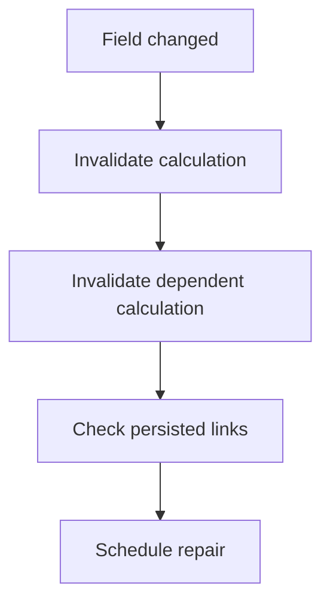
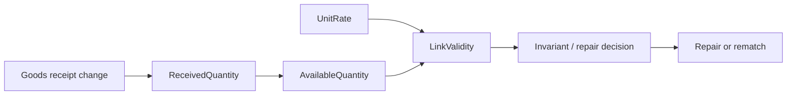
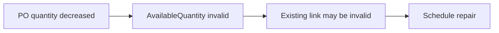

# Raffinert.Relations

**Incremental consistency for .NET object models.**

Raffinert.Relations lets you declare relationships, derived values, and invariants as expression trees.
It analyzes those declarations to build the dependency graph, indexes, reverse navigation, invalidation
rules, and incremental propagation needed to keep a model consistent as objects change.

Instead of manually wiring consistency logic across services and handlers:



you declare the relationships and computations once. The runtime determines **what is affected**, **how
severe the impact is**, and **what work must happen next**.

> You declare domain relationships. Raffinert.Relations derives the consistency machinery.

The dependency-free core targets .NET 8 and .NET 10. The EF Core adapter targets .NET 10 / EF Core 10.
The project is currently experimental and alpha-oriented.

## Why?

Consistency logic in rich applications tends to spread:

- one service updates a field;
- another remembers to invalidate a calculation;
- another knows which persisted links depend on that calculation;
- another decides whether repair or rematching must happen now or can be deferred.

That works until the domain evolves and one of those paths is forgotten.

Raffinert.Relations makes the dependency graph explicit and executable. The same expressions that define
relationships and derived values are analyzed to derive indexes, reverse access paths, change impact, and
propagation behavior.

This is especially useful in domains such as procurement, accounting, pricing, inventory, reservations,
allocation, eligibility, planning, and other models where one business change can have several dependent
consequences.

## Core capabilities

- Expression-defined binary relations whose original predicate remains the semantic authority
- Automatic dependency and nested member-path analysis
- Incremental hash indexes and reverse navigation where analysis proves them safe
- Correct scan fallback for unsupported or opaque query expressions
- Lazy derived state with **Fresh**, **Dirty**, and **Invalid** semantics
- Derived-value dependency graphs, including projected cross-object dependencies
- Exact and conservative propagation strategies
- Incremental `Count`, `LongCount`, `Any`, and numeric `Sum` plans
- Invariants with immediate evaluation, invalidation, or deferred repair
- Summary and causal impact reporting
- Binding execution plans for transaction/outbox integration
- Optional EF Core change-tracker integration
- Compiled-model and runtime diagnostics

The core package has no EF Core or dependency-injection dependency.

## EF Core consistent saves

The EF Core adapter can reject configured invariant violations before SQL and persist sink-only mirrors
of affected derived values:

```csharp
var mappings = new RelationEfCoreMappings()
    .Map(lines)
    .Materialize(availableQuantity, x => x.AvailableQuantity)
    .Enforce(availability);

await db.SaveChangesConsistentlyAsync(runtime, mappings, cancellationToken: cancellationToken);
```

This stable-key workflow plans first, saves once, then installs the exact runtime plan. It does not load
missing graph data. See [EF Core consistency](docs/ef-core-consistency.md) for scope, transactions,
generated keys, and recovery rules, or run the
[`Raffinert.Relations.EntityFrameworkCore.ConsistencySample`](samples/Raffinert.Relations.EntityFrameworkCore.ConsistencySample).

## What Raffinert.Relations is not

It is not an ORM, event bus, or general-purpose workflow engine.

It does not replace your domain objects or persisted business relationships. Its job is narrower:
**given a graph of relationships and computations, efficiently determine and maintain the consequences
of change.**

## Start with a relation

Relations are ordinary expression trees:

```csharp
var model = new RelationModelBuilder();

var invoices = model.Objects<InvoiceLine>()
    .Key(x => x.Id);

var poLines = model.Objects<PurchaseOrderLine>()
    .Key(x => x.Id);

var candidates = model.Relation(invoices, poLines)
    .Where((invoice, poLine) =>
        invoice.PurchaseOrderNumber == poLine.PurchaseOrderNumber &&
        invoice.ItemNumber == poLine.ItemNumber);

var compiled = model.Build();
var runtime = compiled.CreateRuntime();

runtime.Add(invoices, invoice);
runtime.Add(poLines, poLine);

var related = runtime.Related(candidates, invoice);
```

Raffinert.Relations analyzes the predicate and derives hash access paths where it can do so safely.
Unsupported expressions retain the original compiled predicate and fall back to scanning rather than
changing semantics.

## Report ordinary domain changes

Domain objects remain ordinary objects. Mutate them normally, then report what changed:

```csharp
var oldItemNumber = invoice.ItemNumber;
invoice.ItemNumber = "ITEM-2";

runtime.Apply(
    Change.Property(
        invoices,
        invoice,
        x => x.ItemNumber,
        oldItemNumber,
        invoice.ItemNumber));
```

`Change.Property` observes a mutation that has already happened; it does not mutate the object itself.
The runtime validates the change and updates only the runtime-owned state affected by it.

A domain operation can report lifecycle, property, and collection changes together:

```csharp
runtime.Apply(MutationSet.Create(
    Change.Add(poLines, addedLine),
    Change.Property(invoices, invoice, x => x.ItemNumber, oldItem, invoice.ItemNumber),
    Change.CollectionReset(order, x => x.Lines),
    Change.Remove(poLines, removedLine)));
```

The complete mutation set is validated before runtime-maintained state is committed.

## Derived values

Relations become more useful when they feed derived state.

For example, a purchase-order line can derive its received quantity from matching goods receipts:

```csharp
var receivedQuantity = model.Derived(poLines)
    .Using(receipts)
    .Incrementally()
    .Compute((line, matches) =>
        matches.Sum(receipt => receipt.Quantity));
```

Recognized exact aggregates can update already-fresh cache entries directly from relation/item deltas.
Unrecognized expressions retain the original compiled computation as the semantic fallback.

Derived values can depend on other derived values and form a compiled dependency DAG:

```csharp
var availableQuantity = model.Derived(poLines)
    .Using(receivedQuantity)
    .Compute((line, received) =>
        line.OrderedQuantity - received);
```

They can also consume upstream values through tracked object references:

```csharp
var linkValidity = model.Derived(invoiceLinks)
    .Using(link => link.PurchaseOrderLine, availableQuantity, unitRate)
    .Compute((link, available, rate) =>
        link.ReservedQuantity <= available &&
        link.CapturedRate == rate);
```

A change can therefore propagate through a graph such as:



The application does not need to manually orchestrate every edge in that graph.

## Dirty vs Invalid

A dependency becoming stale is not always the same as becoming unsafe.

Raffinert.Relations distinguishes those cases:

- **Dirty** — the cached value must be recomputed when freshness matters.
- **Invalid** — the value must not be relied upon before recomputation or revalidation.

A relation-backed derived value can classify different kinds of impact independently:

```csharp
var received = model.Derived(poLines)
    .Using(receipts)
    .Impact(policy => policy
        .MembershipAdded(DependencySeverity.Dirty)
        .MembershipRemoved(DependencySeverity.Invalid)
        .ItemChanged(DependencySeverity.Invalid))
    .Compute((line, matches) =>
        matches.Sum(receipt => receipt.Quantity));
```

Typed source-member policies can also classify value transitions—for example, a quantity decrease can be
`Invalid` while an increase remains merely `Dirty`.

## Invariants and repair

Invariants consume direct or derived state and can react when correctness is affected. Reactions can be
immediate or represented as deferred repair work.

This lets a domain model express patterns such as:



without embedding the repair orchestration into every command handler that can affect quantity.

## Explain what changed

Basic `Apply` performs the runtime update without building diagnostic impact data.

When impact needs to be inspected or persisted, use a detailed operation:

```csharp
var application = runtime.ApplyDetailed(
    mutations,
    RuntimeImpactDetailLevel.Causal);

Console.WriteLine(
    RuntimeImpactTraceRenderer.Render(application.Result));
```

Detailed results can include relation pair deltas, affected derived values, invariant impacts, policy
requests, mutation origins, and deterministic direct-cause records.

For durable background work, project the in-process result to strict data-only work:

```csharp
DurablePolicyWork durableWork =
    application.Result.GetDurablePolicyWork();
```

Stable definition names and canonical source identities are required when data crosses a process boundary.

## Transaction and outbox integration

External persistence can separate mutation preparation, runtime commit, and callback dispatch:

```csharp
var prepared = runtime.Prepare(
    mutations,
    ChangeValidationMode.StrictNewValue);

await database.SaveChangesAsync();

runtime.Commit(prepared);
runtime.Dispatch(prepared);
```

When durable external work must exactly match the runtime result, use a binding plan:

```csharp
var plan = runtime.PlanDetailed(
    prepared,
    RuntimeImpactDetailLevel.Causal);

PersistDurablePolicyWork(
    plan.Result.GetDurablePolicyWork());

await database.CommitAsync();

runtime.Commit(plan);
runtime.Dispatch(plan);
```

`PlanDetailed` is binding: semantic classification and propagation are executed once, runtime state is
restored, and the plan retains the forward state needed by the later commit. `Commit(plan)` installs that
same result rather than rerunning semantic code.

`PreviewDetailed` is intentionally different: it is diagnostic and non-binding, so a later ordinary commit
may execute semantic code again.

If the business database commits but runtime installation later fails, the database is authoritative;
rebuild or reconcile the runtime from durable state rather than retrying the database mutation blindly.

## EF Core integration

The EF Core adapter can translate change-tracker state into the same core mutation model.

`SaveChangesAndApply` / `SaveChangesAndApplyAsync` provide the simple ordering case. More advanced
transaction/outbox workflows can explicitly capture a `RelationUnitOfWork`, then use its prepare, plan,
commit, and dispatch phases.

Generated keys are supported, including workflows where final identities become available only after the
first `SaveChanges` inside a database transaction.

See the architecture and example documentation for the exact transaction boundaries and recovery rules.

## Exact vs conservative propagation

Correctness and storage strategy are separate concerns.

Exact propagation can retain matching relation pairs and invalidate only exact affected sources.
Full-recompute consumers can instead opt into conservative propagation, avoiding permanent pair retention
while invalidating a safe source superset.

The original relation predicate remains the semantic authority in either case.

Query access, reverse candidate access, and propagation strategy are reported independently in compiled
diagnostics.

## Dependency analysis safety

Cached derived computations, invariants, and relations used for propagation require complete dependency
analysis by default.

`Build()` rejects opaque code or mutable captured/static state when the runtime could not guarantee cache
freshness. Direct-query-only relations may remain opaque because their predicate is evaluated at query time.

Deliberate prototypes can opt into weaker guarantees with `AllowIncompleteDependencies()`. Diagnostics make
that weaker contract visible.

## Diagnostics and performance

`compiled.DebugView` provides a human-readable description of the compiled model.

`compiled.Diagnostics` exposes structured object-set, relation, derived-value, invariant, access-plan,
propagation, and completeness information.

`runtime.Diagnostics` exposes incremental-work counters and relation statistics such as index sizes,
materialized pair count, fan-out, and density warnings.

The repository also contains BenchmarkDotNet benchmarks and recorded results for propagation precision,
planning, bootstrap/projection, commit safety, and related runtime costs.

## Runtime contracts worth knowing

- Domain mutation is external; change objects report mutations that have already happened.
- Registered object keys are immutable. Remove/re-add when identity genuinely changes.
- Mutation sets are validated atomically before runtime-owned state is committed.
- Collection navigation is explicit through add/remove/reset change records.
- A prepared mutation is versioned and rejected if the runtime advances before commit.
- Policy callbacks are dispatched only after runtime-owned state commits.
- `RelationRuntime` is not thread-safe; callers must externally synchronize mutations and queries.

The detailed edge-case contracts live in the architecture documentation rather than this landing page.

## Documentation

- [Architecture and runtime contracts](docs/architecture.md)
- [End-to-end purchase order and goods receipt example](docs/purchase-order-example.md)
- [Current implementation roadmap](docs/roadmaps/README.md)
- [Measured-workload optimizer policy](docs/optimizer-policy.md)
- [Release and versioning process](RELEASING.md)
- [Changelog](CHANGELOG.md)

## Project status

Raffinert.Relations is experimental. The core behavior suite runs on .NET 8 and .NET 10; the EF Core
integration suite targets .NET 10. CI restores, builds, tests, formats, packs, and validates the public API
and package metadata. Main-branch CI produces package artifacts but does not publish them automatically.
